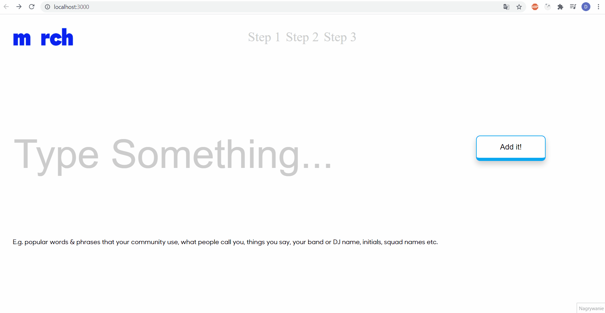

# Merch
&nbsp;

# Table of contents
1. [What is this repository about](#introduction)
2. [Tools and external libraries used for the project](#tools)
3. [Presentation of the project](#presentation)
4. [How to view the project](#installation)
5. [Contact](#Contact)
6. [License](#License)
7. [Acknowledgments](#Acknowledgments)
&nbsp;
---

### What is this repository about

#### Merch is a small project where I created a site where you can add your own tags, then you can proceed to the next site where the tags added are visible on the right site of the screen as an array of objects.
&nbsp;
---

### Tools and external libraries used for the project
 1. HTML 5
 2. CSS 3
 3. React
 4. React Hooks
 5. React Router
 6. [Flexbox](https://css-tricks.com/snippets/css/a-guide-to-flexbox/)
&nbsp;
---

### Presentation of the Project
&nbsp;

&nbsp;

### How to view the project

#### In order to see the project simply clone the repository and run the index.html file in your browser.
&nbsp;
---

### Contact

#### You can contact me via my personal Email: dawidk65@gmail.com
&nbsp;
---

### License

#### This project is licensed under the MIT License
&nbsp;
---

### Acknowledgments

#### Merch Project is my fourth repository in which I have recreated a small website for training purposes. I wanted to advance my skills as a React Developer and create a something I haven't tried before. I have designed a website which resembles an online shop where the user can create their own tshirt with personalized tags.
&nbsp;
